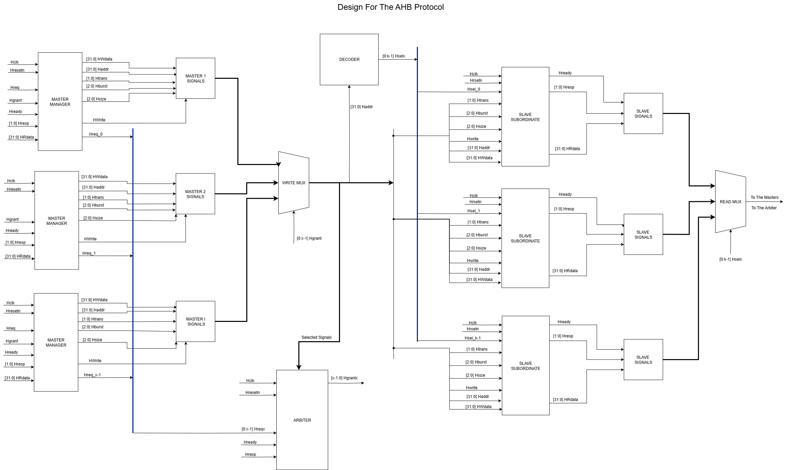
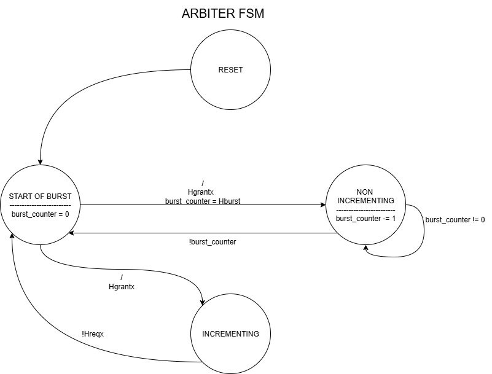
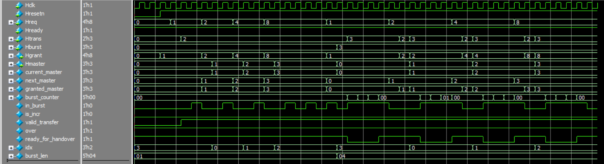
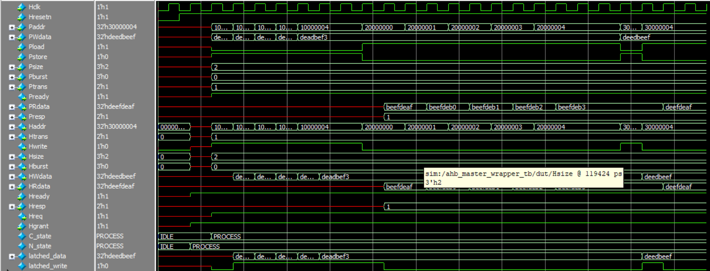
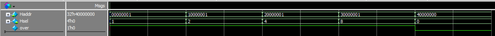
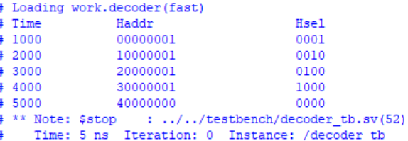

# AHB Bus — Documentation

This documentation contains the full manual for the AHB Bus SystemVerilog IP: installation, theory, user and developer guides, API reference, and contribution instructions.

Quick links
- [Installation](installation.md)
- [Theory of Operation](theory.md)
- [User Guide](user_guide.md)
- [Developer Guide](developer_guide.md)
- [API Reference](api_reference.md)
- [Contributing](contributing.md)

Front page content

Refer to the repository's README for a short project summary and quick start instructions. Diagrams are in `docs/image_design/`.
# AMBA AHB BUS PROTOCOL

> **Hardware AHB BUS (SystemVerilog Implementation)**
> The **AMBA AHB (Advanced High-performance Bus)** is a high-speed bus protocol introduced by ARM ltd. for efficient on-chip communication between components such as microprocessors, memory interfaces, and peripherals.
>
> 🗕️ *Last updated: August 26, 2025*
> © 2025 [Maktab-e-Digital Systems Lahore](https://github.com/meds-uet). Licensed under the Apache 2.0 License.

---

The AMBA Advanced High-performance Bus (AHB) is a bus protocol introduced by ARM ltd. for on-chip communication between components such as microprocessors, memory interfaces, and peripherals. AHB is a high-performance bus protocol and is the de facto standard for on-chip communication in the majority of modern digital design systems. The AHB protocol is a synchronous, multi-master, multi-slave bus protocol.

## Components of AHB
- **Arbiter**: Manages access to the bus, ensuring that only one master can use the bus at a time.

- **Master**: Initiates read and write operations by providing address and control signals.

- **Slave**: Responds to master requests, providing data for read operations or receiving data for write operations.

- **Bus**: The physical interconnect that carries data, address, and control signals between components.

- **Decoder**: Determines which slave the master intends to communicate with, based on the address provided.

- **Master to Slave Multiplexer (MSMUX)**: A multiplexer that selects the master that is currently accessing the bus.

- **Slave to Master Multiplexer (SMMUX)**: A multiplexer that selects the slave that is currently being accessed by the master.

# BLOCK DIAGRAM  

## Main Features of AHB Bus Protocol

The AHB Protocol features supported here include:

### 1. Single Clock Edge Operation
- All operations are synchronized to the rising edge of a single system clock.
- Simplifies timing analysis and enhances performance.

### 2. Burst Transfers
- Supports burst types: `SINGLE`, `INCR`, `WRAP4`, `INCR4`, `INCR8`, `INCR16`, etc.
- Improves efficiency by reducing address/control overhead during sequential data transfers.

### 3. Pipelined Operation
- AHB supports pipelining with separate address and data phases.
- Enables a new transfer to begin before the previous one completes.

### 4. Multi-Master Support
- Supports multiple bus masters like CPU, DMA, etc. Only one master drives the bus at a time.

### 5. Address and Data Bus Multiplexing
- AHB uses shared lines for address and data to reduce pin count.

### 6. 32-bit or 64-bit Data Bus
- Data bus is typically 32-bit wide but can be extended to 64-bit.

### 7. Error Reporting via HRESP
- `HRESP` returns `OKAY` (normal) or `ERROR` (error occurred).

### 8. External Arbitration Logic
- Arbitration between masters is handled outside the AHB bus (e.g., round-robin or fixed-priority).

### 9. Transfer Types
- `IDLE`, `BUSY`, `NONSEQ`, `SEQ`

### 10. Handshaking Between Master and Slave
- `HREADY` and `HRESP` coordinate transfers.

### 11. Memory-Mapped Support
- Each device is assigned a specific address region.

## Summary Table

| Feature              | Description                                      |
|----------------------|--------------------------------------------------|
| Pipelined            | Yes (address/data phases separated)              |
| Burst transfers      | Supported (SINGLE, INCR, WRAP, etc.)             |
| Arbitration          | External (master-side)                           |
| Bus width            | 32 or 64 bits                                    |
| Multi-master support | Yes                                              |
| Response types       | OKAY, ERROR                                      |
| Transfer types       | IDLE, BUSY, NONSEQ, SEQ                          |
| Handshaking          | HREADY and HRESP                                 |
| Clocking             | Single rising-edge clock                         |
| Address mapping      | Fully memory-mapped device space                 |

---
### 🧠 Tip
\
AHB sits between **APB (simple)** and **AXI (advanced)** in terms of complexity and performance.

---

# Component Description
This section goes over the description of each of the components used in the AHB bus protocol.

Since the main component of this protocol is **Arbiter** that controls the flow of **Data, Address** and **Control Signals** so lets start with this

---

# Module: ahb_arbiter

## STG Diagram

## Description
This module implements an **AHB bus arbiter** that uses a **Round-Robin Priority Algorithm** to grant bus access to multiple masters.  
It manages bus access based on master requests, transaction types, and burst types, ensuring fair allocation and proper handling of burst transfers.

**Functionality:**
- Implements round-robin priority among multiple AHB masters.  
- Handles single and burst transfers (SINGLE, INCR, WRAP, INCR4/8/16, WRAP4/8/16).  
- Tracks ongoing bursts and prevents bus handover until burst completion.  
- Generates grant signals (`Hgrant`) and outputs the currently active master (`Hmaster`).  
- Supports multiple masters and ensures fair bus access while respecting valid transfers.

---

## Parameter/Constant Definitions
- `NUM_MASTERS` : Total number of AHB masters in the system (from `parameters.svh`)  
- `MASTER_WIDTH` : Width to encode master index (from `parameters.svh`)  

---

## Ports

### Inputs
| Port | Width | Description |
|------|-------|-------------|
| Hclk | 1 | AHB clock |
| Hresetn | 1 | Active-low reset |
| Hreq | `NUM_MASTERS` | Master request signals |
| Hready | 1 | Global slave ready signal |
| Htrans | 2 | Transaction type (IDLE, NONSEQ, SEQ) |
| Hburst | 3 | Burst type (SINGLE, INCR, WRAP, INCR4/8/16, WRAP4/8/16) |

### Outputs
| Port | Width | Description |
|------|-------|-------------|
| Hgrant | `NUM_MASTERS` | Grant signal to masters |
| Hmaster | `MASTER_WIDTH` | Index of currently active master |

---

## Internal Signals
- `current_master`, `next_master`, `granted_master` : Tracks current and next master for arbitration  
- `burst_counter` : Counts remaining transactions in a burst  
- `in_burst` : Indicates if a burst is currently active  
- `is_incr` : Flag for INCR bursts  
- `valid_transfer` : Indicates if the current transfer is valid  
- `over` : Temporary flag for round-robin calculation  
- `ready_for_handover` : Indicates if bus can be handed over to another master  
- `idx` : Temporary index for round-robin selection  
- `burst_len` : Decoded burst length based on `Hburst`  

---

## Round-Robin Algorithm
- Starting from `current_master`, the arbiter searches sequentially for the next requesting master.  
- Wraps around if the end of master list is reached.  
- `next_master` is selected only if the current master is done or handover conditions are met.

---

## Burst Handling
- Burst length is decoded based on `Hburst`.  
- `in_burst` tracks ongoing burst, preventing handover mid-burst.  
- INCR bursts continue until the master drops its request.  
- Non-INCR bursts decrement `burst_counter` on each valid transfer until zero.  

---

## Grant Decision
- `granted_master` is updated if `ready_for_handover` is true and the transaction type is `NONSEQ`.  
- `Hgrant` is asserted only for the granted master.  
- `valid_transfer` ensures Hready and proper transaction type before counting towards burst completion.  

---

## FSM Overview
- No explicit FSM state variable; behavior is controlled via `current_master`, `in_burst`, and `burst_counter`.  
- Bus handover is controlled by:
  - `!in_burst`  
  - Burst completion for fixed bursts  
  - Master dropping request for INCR bursts  

---

## Notes
- Round-robin arbitration guarantees fair access among multiple masters.  
- Supports single, incremental, and wrapping bursts.  
- Hmaster reflects the currently active master for external logic or monitoring.  
- Designed for AHB3-Lite compliant interconnects.  

---

## Dependencies
- `parameters.svh` for `NUM_MASTERS` and `MASTER_WIDTH` definitions.  

---

## Example Usage
Connect multiple AHB masters to `Hreq` and feed their transaction signals to the arbiter.  
The outputs `Hgrant` and `Hmaster` can then be used to control the AHB bus interconnect, ensuring fair and correct access to the bus.

### Allocation Algorithm
The allocation algorithm used in the Arbiter is a Round Robin priority algorithm. It works as follows:

- The Arbiter keeps track of the priority of each master.

- When only a single master requests the bus, it is granted the access.

- When multiple masters request the bus at the same time, the Arbiter grants the bus to the highest priority master.

- If the highest priority master does not have a valid request, the Arbiter moves to the next highest priority master.

- If all masters have a valid request, the Arbiter grants the bus to each master in round robin order.

- If a master does not have a valid request when it is its turn, the Arbiter moves to the next highest priority master.

- It allows only one burst from one master in a single request.

# Module: ahb_master_wrapper

## Description
This module is a wrapper for an AHB3-Lite master interface. It connects a functional module (with simple load/store interface) to an AHB bus through a standard AHB master interface. It also handles arbitration requests and grants for bus access.

**Functionality:**
- Converts simple functional interface signals (`Paddr`, `PWdata`, `Pload`, `Pstore`, etc.) into AHB master signals (`Haddr`, `Htrans`, `Hwrite`, `Hsize`, `Hburst`, `HWdata`).
- Handles data latching for writes when `Hready` is low.
- Manages master state machine (IDLE and PROCESS) to control transaction flow based on `Hready` and `Hgrant` signals.
- Supports both single transfers and burst transfers.

---

## Parameter/Constant Definitions
- `ADDR_WIDTH` : Width of the address bus (from `parameters.svh`)  
- `DATA_WIDTH` : Width of the data bus (from `parameters.svh`)  

---

## Ports

### Functional Module Interface
| Port | Direction | Width | Description |
|------|-----------|-------|-------------|
| Paddr | input | `ADDR_WIDTH` | Address of the transaction |
| PWdata | input | `DATA_WIDTH` | Data to be written |
| Pload | input | 1 | Read request |
| Pstore | input | 1 | Write request |
| Psize | input | 3 | Size of transfer |
| Pburst | input | 3 | Burst type |
| Ptrans | input | 2 | Transfer type (IDLE, BUSY, NONSEQ, SEQ) |
| Pready | output | 1 | Transaction ready |
| PRdata | output | `DATA_WIDTH` | Read data |
| Presp | output | 2 | Response from slave |

### AHB Master Interface
| Port | Direction | Width | Description |
|------|-----------|-------|-------------|
| Haddr | output | `ADDR_WIDTH` | AHB address |
| Htrans | output | 2 | AHB transfer type |
| Hwrite | output | 1 | Write signal |
| Hsize | output | 3 | Transfer size |
| Hburst | output | 3 | Burst type |
| HWdata | output | `DATA_WIDTH` | Write data |
| HRdata | input | `DATA_WIDTH` | Read data |
| Hready | input | 1 | Slave ready signal |
| Hresp | input | 2 | Slave response |

### Arbiter Interface
| Port | Direction | Width | Description |
|------|-----------|-------|-------------|
| Hreq | output | 1 | Request access to bus |
| Hgrant | input | 1 | Bus grant from arbiter |

---

## Internal Signals
- `C_state`, `N_state` : Current and next state of FSM  
- `latched_data` : Latched write data (`DATA_WIDTH`)  
- `latched_write` : Flag to indicate latched write  

---

## State Machine

### IDLE
- Waits for `Hgrant` and `Hready` to start a transfer.  
- Sets `Haddr`, `Htrans`, `Hsize`, `Hburst`, `Hwrite` signals when granted.  
- Transitions to PROCESS state.

### PROCESS
- Executes read/write transaction.  
- Latches write data if necessary.  
- Updates functional module outputs (`PRdata`, `Pready`, `Presp`).  
- Handles burst and single transfers by incrementing address if needed.  
- Returns to IDLE when `Hgrant` is lost.

---

## Notes
- Latching of write data ensures correct data is sent even if `Hready` is low during the previous cycle.  
- Currently supports basic burst addressing calculation (`address + 1 << Psize`).  
- `Pready` and `Presp` are directly driven from `Hready` and `Hresp` signals.  
- `Hreq` is asserted whenever a functional module requests a load or store.  

---

## Dependencies
- `parameters.svh` for `ADDR_WIDTH` and `DATA_WIDTH` definitions.

---

## Example Usage
Connect a functional module (e.g., CPU or DMA interface) to this wrapper, then connect the wrapper outputs to an AHB interconnect or bus.

# Module: ahb_slave_wrapper 

## Description
This module is an **AHB bus slave wrapper** that maps the input and output signals to a selected slave device.  
It interfaces a slave with the AHB bus, handling transaction decoding, latching, and read/write control.

**Functionality:**
- Maps incoming AHB signals (`Haddr`, `Htrans`, `Hwrite`, `HWdata`, etc.) to internal slave signals.  
- Captures address and data during valid transactions.  
- Generates read/write enable signals for the slave.  
- Propagates slave outputs (`read_data`, `slave_ready`, `slave_resp`) to the AHB bus.  
- Supports standard AHB transfer phases and ready/response signaling.

---

## Parameter/Constant Definitions
- `ADDR_WIDTH` : Width of the AHB address bus (from `parameters.svh`)  
- `DATA_WIDTH` : Width of the AHB data bus (from `parameters.svh`)  
- `SLAVE_WIDTH` : Width of slave response signal (from `parameters.svh`)  

---

## Ports

### Inputs
| Port | Width | Description |
|------|-------|-------------|
| Hclk | 1 | AHB clock |
| Hresetn | 1 | Active-low reset |
| Haddr | `ADDR_WIDTH` | AHB address bus |
| Htrans | 2 | Transaction type (IDLE, NONSEQ, SEQ) |
| Hwrite | 1 | Write signal |
| Hsize | 3 | Transfer size |
| Hburst | 3 | Burst type |
| HWdata | `DATA_WIDTH` | Write data bus |
| Hstrob | `DATA_WIDTH/8` | Byte-enable strobes |
| Hsel | 1 | Slave select signal |
| Hready | 1 | Global ready signal from interconnect |

### Outputs
| Port | Width | Description |
|------|-------|-------------|
| HRdata | `DATA_WIDTH` | Data read from slave |
| Hreadyout | 1 | Ready signal from slave |
| Hresp | `SLAVE_WIDTH` | Response signal from slave (OKAY, ERROR, etc.) |

---

## Internal Signals
- `addr_reg` : Captures the address of the current transaction  
- `write_en` : Write enable signal for the slave  
- `read_en` : Read enable signal for the slave  
- `write_data_reg` : Latched write data for the slave  
- `read_data` : Read data from the slave  
- `slave_ready` : Ready signal from the slave  
- `slave_resp` : Response signal from the slave  
- `trans_valid` : Indicates a valid AHB transaction (selected, Hready high, NONIDLE transfer)  

---

## Operation
1. **Transaction Detection:**  
   A transaction is valid when the slave is selected (`Hsel`), `Hready` is high, and `Htrans[1]` indicates a NON-IDLE transfer.  

2. **Latching Inputs:**  
   - During a valid transaction, the address and write data are latched.  
   - Write enable (`write_en`) is asserted if `Hwrite` is high; otherwise, `read_en` is asserted.  

3. **Reset Behavior:**  
   - On reset (`Hresetn` low), all internal registers and control signals are cleared.  

4. **Output Assignment:**  
   - `HRdata` is assigned from `read_data` from the slave.  
   - `Hreadyout` and `Hresp` propagate slave signals to the AHB bus.

---

## Notes
- Designed as a generic wrapper to interface AHB-compliant slaves with a bus.  
- Supports byte-enable strobes (`Hstrob`) for partial writes.  
- Transaction phase decoding ensures proper latching of address and data.  
- Read/write signals are mutually exclusive (`write_en` and `read_en`).  

---

## Dependencies
- `parameters.svh` for `ADDR_WIDTH`, `DATA_WIDTH`, and `SLAVE_WIDTH` definitions.  

---

## Example Usage
Connect an AHB-compliant slave module to this wrapper:  
- Inputs (`Haddr`, `HWdata`, etc.) come from the AHB interconnect.  
- Outputs (`HRdata`, `Hreadyout`, `Hresp`) go back to the interconnect.  
- Internally, the slave can use `addr_reg`, `write_data_reg`, `write_en`, and `read_en` for its operations.

## Bus

The bus sits between the masters and slaves, responsible for connecting the correct master to the correct slave. This is the shared resource whose access is granted by the arbiter. This contains the interconnect, decoder and the arbiter.

The decoder gives the appropriate signals to select which slave is active, the arbiter decides which master is active, the interconnect routes the signals from the active master to the selected slave according to the signals provided by the arbiter and decoder.

# Module: decoder 

## Description
This module is an **AHB bus address decoder** that determines which slave is selected based on the incoming address.  
It outputs a one-hot select signal (`Hsel`) to indicate the active slave.

**Functionality:**
- Maps an incoming AHB address (`Haddr`) to a slave selection signal (`Hsel`).  
- Ensures only one slave is selected at a time using a one-hot encoding.  
- Supports multiple slaves as defined by `NUM_SLAVES`.  

---

## Parameter/Constant Definitions
- `ADDR_WIDTH` : Width of the AHB address bus (from `parameters.svh`)  
- `NUM_SLAVES` : Number of slaves connected to the bus (from `parameters.svh`)  
- `BASE_ADDR[i]` : Base address of the i-th slave  
- `HIGH_ADDR[i]` : High address of the i-th slave  

---

## Ports

### Inputs
| Port | Width | Description |
|------|-------|-------------|
| Haddr | `ADDR_WIDTH` | Address bus from the AHB master |

### Outputs
| Port | Width | Description |
|------|-------|-------------|
| Hsel | `NUM_SLAVES` | One-hot select signal for the slaves |

---

## Internal Signals
- `over` : Flag to ensure only the first matching slave is selected in case of overlapping address ranges  

---

## Operation
1. **Initialization:**  
   - All `Hsel` outputs are cleared to 0.  

2. **Slave Selection:**  
   - Iterate through all slaves (`i = 0` to `NUM_SLAVES-1`).  
   - If `Haddr` falls within the range `[BASE_ADDR[i], HIGH_ADDR[i])` and no slave has been selected yet (`!over`):  
     - Set `Hsel[i] = 1`.  
     - Set `over = 1` to prevent additional slaves from being selected.  

---

## Notes
- Only the first matching slave is selected in case of overlapping address ranges.  
- Designed for AHB-compliant systems with multiple slaves.  
- `Hsel` is one-hot encoded.  

---

## Dependencies
- `parameters.svh` for `ADDR_WIDTH`, `NUM_SLAVES`, `BASE_ADDR`, and `HIGH_ADDR` definitions.  

---

## Example Usage
Connect this decoder between an AHB master and multiple slaves:  
- Input `Haddr` comes from the AHB master.  
- Output `Hsel` is connected to the `Hsel` input of each slave.  
- Only one slave will respond based on the address range of `Haddr`.

# Module: master_to_slave_mux 

## Description
This module is a **master-to-slave multiplexer** for the AHB bus. It selects the signals of one master (based on the arbiter-selected master index `Hmaster`) and outputs the corresponding address, data, and control signals onto the shared bus.

**Functionality:**
- Multiplexes signals from multiple masters (`NUM_MASTERS`) onto the shared AHB bus.  
- Outputs address, data, and control signals from the selected master.  

## Parameters/Constants
- `MASTER_WIDTH` : Width for the master index  
- `NUM_MASTERS`  : Total number of masters  
- `DATA_WIDTH`   : Width of the data bus  

## Ports

### Inputs
| Port      | Width                     | Description                        |
|-----------|---------------------------|------------------------------------|
| Hmaster   | `MASTER_WIDTH`            | Index of the selected master       |
| Haddr_M   | `DATA_WIDTH` [`NUM_MASTERS`] | Address buses of all masters    |
| Htrans_M  | 2 [`NUM_MASTERS`]         | Transfer types of all masters      |
| Hwrite_M  | 1 [`NUM_MASTERS`]         | Write signals of all masters       |
| Hsize_M   | 3 [`NUM_MASTERS`]         | Transfer sizes of all masters      |
| Hburst_M  | 3 [`NUM_MASTERS`]         | Burst types of all masters         |
| Hstrob_M  | `DATA_WIDTH/8` [`NUM_MASTERS`] | Write strobes of all masters  |
| Hwdata_M  | `DATA_WIDTH` [`NUM_MASTERS`] | Write data of all masters       |

### Outputs
| Port      | Width                     | Description                        |
|-----------|---------------------------|------------------------------------|
| Haddr     | `DATA_WIDTH`              | Selected master’s address          |
| Htrans    | 2                         | Selected master’s transfer type    |
| Hwrite    | 1                         | Selected master’s write signal     |
| Hsize     | 3                         | Selected master’s transfer size    |
| Hburst    | 3                         | Selected master’s burst type       |
| Hstrob    | `DATA_WIDTH/8`            | Selected master’s write strobes    |
| Hwdata    | `DATA_WIDTH`              | Selected master’s write data       |

---

## Dependencies
- `parameters.svh` for `ADDR_WIDTH`, `NUM_SLAVES`, `BASE_ADDR`, and `HIGH_ADDR` definitions.  

# Module: slave_to_master_mux
  

## Description
This module is a **slave-to-master multiplexer** for the AHB bus. It selects data and response signals from the addressed slave (based on the decoder’s `Hsel` signals) and routes them to the active master.

**Functionality:**
- Multiplexes read data, response, and ready signals from multiple slaves to the selected master.  
- Maintains a pipelined selection of the active slave to ensure proper timing of AHB responses.

## Parameters/Constants
- `NUM_SLAVES`   : Total number of slaves  
- `NUM_MASTERS`  : Total number of masters  
- `MASTER_WIDTH` : Width of master index  
- `DATA_WIDTH`   : Width of the data bus  

## Ports

### Inputs
| Port          | Width                          | Description                           |
|---------------|--------------------------------|---------------------------------------|
| Hclk          | 1                              | System clock                          |
| Hresetn       | 1                              | Active-low reset                       |
| Hsel          | `NUM_SLAVES`                  | One-hot selected slave signal          |
| Hmaster       | `MASTER_WIDTH`                | Index of selected master               |
| Hrdata_S      | `DATA_WIDTH` [`NUM_SLAVES`]   | Read data from each slave              |
| Hresp_S       | 2 [`NUM_SLAVES`]               | Response from each slave               |
| Hreadyout_S   | 1 [`NUM_SLAVES`]               | Ready signal from each slave           |

### Outputs
| Port      | Width                         | Description                        |
|-----------|-------------------------------|------------------------------------|
| Hrdata    | `DATA_WIDTH` [`NUM_MASTERS`]  | Read data routed to selected master |
| Hresp     | 2 [`NUM_MASTERS`]              | Response routed to selected master  |
| Hready    | 1                              | Global ready signal for the master  |

## Dependencies
- `parameters.svh` for `ADDR_WIDTH`, `NUM_SLAVES`, `BASE_ADDR`, and `HIGH_ADDR` definitions.  

# Simulation Results

This section presents the simulation results for key AHB modules: **Arbiter**, **Master**, and **Decoder**. Each subsection includes a brief description and waveform snapshots.

---

## 1. Arbiter Module Simulation

**Description:**  
The arbiter was tested with multiple masters requesting the bus simultaneously. The round-robin priority algorithm ensures fair grant distribution.  

**Observations:**  
- `Hgrant` correctly follows the round-robin sequence.  
- Only one master is granted at a time.  
- Bursts are handled correctly with `Hready` synchronization.

**Simulation Waveform:**  

**Notes:**  
- Waveform shows `Hreq` signals for 4 masters and the corresponding `Hgrant` signals.  
- The active master index `Hmaster` updates correctly with each grant.

---

## 2. Master Module Simulation

**Description:**  
The `ahb_master_wrapper` was tested for single and burst transfers.  

**Observations:**  
- Write data is correctly latched when `Hready` is low.  
- Read data (`PRdata`) is correctly captured from `HRdata`.  
- `Pready` and `Presp` reflect slave responses accurately.

**Simulation Waveform:**  

**Notes:**  
- Waveform shows a write followed by a read transaction.  
- Burst transfer increments address correctly according to `Psize`.

---

## 3. Decoder Module Simulation

**Description:**  
The `decoder` was tested with multiple address ranges to ensure correct slave selection.  

**Observations:**  
- Only one `Hsel` is asserted for the given `Haddr`.  
- Out-of-range addresses result in all `Hsel` signals deasserted.

**Simulation Waveform:**  

**Results:**  

**Notes:**  
- Waveform shows address changes and corresponding one-hot `Hsel` outputs.
